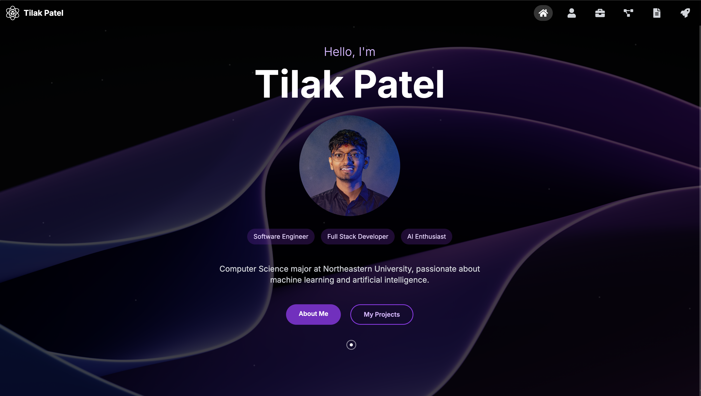

# Tilak Patel's Personal Portfolio Website
# www.tilakpatell.com



Welcome to my personal portfolio website! This site showcases my skills, projects, experiences, and interests in a dynamic and interactive manner. Below, I've included detailed information about the site's features, technologies used, and installation instructions.

## Table of Contents
- [Features](#features)
- [Technologies Used](#technologies-used)
- [Usage](#usage)
- [Project Structure](#project-structure)

## Features

### Home Section
- **Dynamic Typing Animation:** The homepage features a typing animation that cycles through various professional titles using react-simple-typewriter.
- **Interactive Emoji:** An emoji changes in sync with the typing animation.
- **Animated Welcome Text:** A "Welcome" text with individual letter animations.
- **Profile Picture:** Displays my profile picture with a gradient border and shadow effect, animated on hover.

### Navbar
- **Interactive Navbar:** Includes icons that link to my LinkedIn, GitHub, and Instagram profiles.
- **Smooth Scrolling:** Implements smooth scrolling to different sections of the website.

### Experience Section
- **Interactive Cards:** Expandable cards showcasing my work experiences.
- **Technology Stack Display:** Visual representation of my technology stack using icons.

### Projects Section
- **Project Showcase:** A section dedicated to showcasing my projects with descriptions, technologies used, and links to their respective repositories.
- **Live Demo Links:** Where applicable, links to live demos of the projects.

### Resume Section
- **Downloadable Resume:** Option to view and download my latest resume.
- **Resume Preview:** A visual preview of my resume.

### Journey Section
- **Journey Section:** A Dynamic graph to show my progress in coding and college.

### General Features
- **Responsive Design:** The website is fully responsive and optimized for various screen sizes.
- **Dark Mode:** Implements a dark color scheme for better viewing experience.
- **Animations:** Various animations throughout the site using Framer Motion for a more engaging user experience.

## Technologies Used

### Frontend:
- React (v18.2.0)
- Vite (v4.3.9) for fast development and building
- Tailwind CSS (v3.3.2) for styling
- Framer Motion (v10.12.18) for animations
- react-icons (v4.10.1) for various icons
- react-simple-typewriter (v5.0.1) for typing animation
- react-vertical-timeline-component (v3.6.0) for experience timeline

### Development Tools:
- ESLint (v8.38.0) for code linting
- Prettier (v2.8.8) for code formatting

## Usage
1. Clone the repository:
    ```bash
    git clone https://github.com/tilakpatel/portfolio.git
    cd portfolio
    ```

2. Install dependencies:
    ```bash
    npm install
    ```

3. Run the development server:
    ```bash
    npm run dev
    ```

4. Open your browser and visit `http://localhost:3000` to see the website.

## Project Structure
```plaintext
portfolio/
├── public/
│   ├── favicon.ico
│   └── index.html
├── src/
│   ├── assets/
│   ├── components/
│   │   ├── Navbar.js
│   │   ├── Home.js
│   │   ├── Experience.js
│   │   ├── Projects.js
│   │   ├── Resume.js
│   │   └── Contact.js
│   ├── App.js
│   ├── index.css
│   └── main.jsx
├── .eslintrc.js
├── .prettierrc
├── package.json
└── vite.config.js
