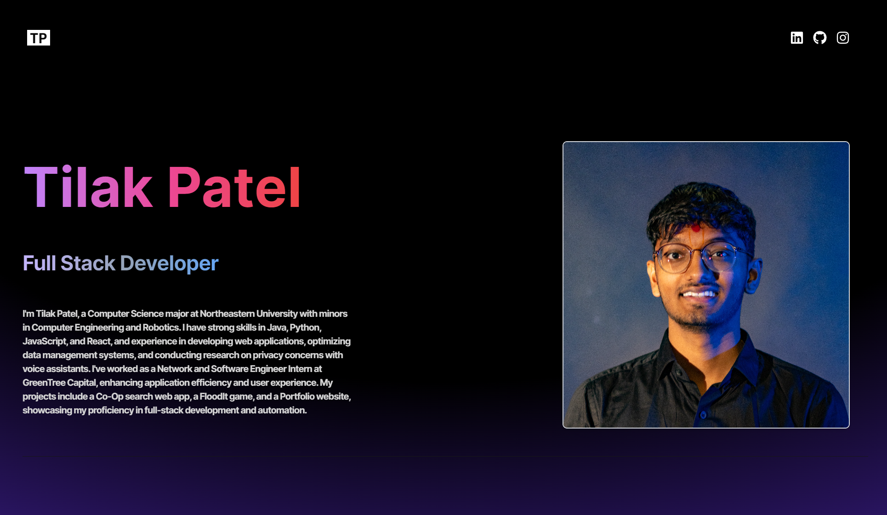

# Tilak Patel's Personal Portfolio Website



Welcome to my personal portfolio website! This site showcases my skills, projects, experiences, and interests dynamically and interactively. Below, I've included detailed information about the site's features and how to navigate through it.

## Table of Contents

- [Features](#features)
- [Technologies Used](#technologies-used)
- [Installation](#installation)

## Features

- **Dynamic Typing Animation:** The homepage features a typing animation that cycles through various professional titles.
- **Interactive Navbar:** The navbar includes icons that link to my LinkedIn, GitHub, and Instagram profiles.
- **Project Showcase:** A section dedicated to showcasing my projects with descriptions and links to their respective repositories.
- **Responsive Design:** The website is fully responsive and looks great on all devices.
- **Profile Picture:** Displays my profile picture with a gradient border and shadow effect.

## Technologies Used

- **Frontend:**
  - React
  - Vite
  - Tailwind CSS
  - react-icons
  - react-simple-typewriter

## Installation

To run this project locally, follow these steps:

1. **Clone the repository:**

   ```bash
   git clone https://github.com/tilakpatell/my-portfolio-website.git
